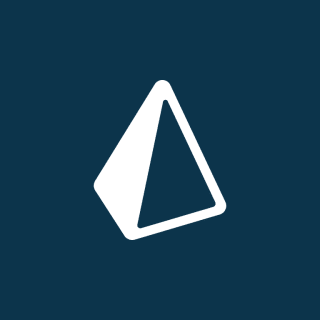

# Teamseas

Basic project putting together Nest, Prisma, GraphQL, React.

## Applications

* [Teamseas-api](./teamseas-api/README.md)

    Nest, Prisma, GraphQL (with Subscriptions)

  
  
  

* [Teamseas-ui](./teamseas-ui/README.md)

    React, Hooks, Chakra-ui, Urql, GraphQl

    
    
    
    

## Teamseas-ui
### Home page

###  Donation Form

## Teamseas-api
### GraphQL Sandbox

## References

* [mariusespejo/team-seas-clone](https://github.com/mariusespejo/team-seas-clone) - [youtube](https://www.youtube.com/watch?v=lddaR8Y-gko)