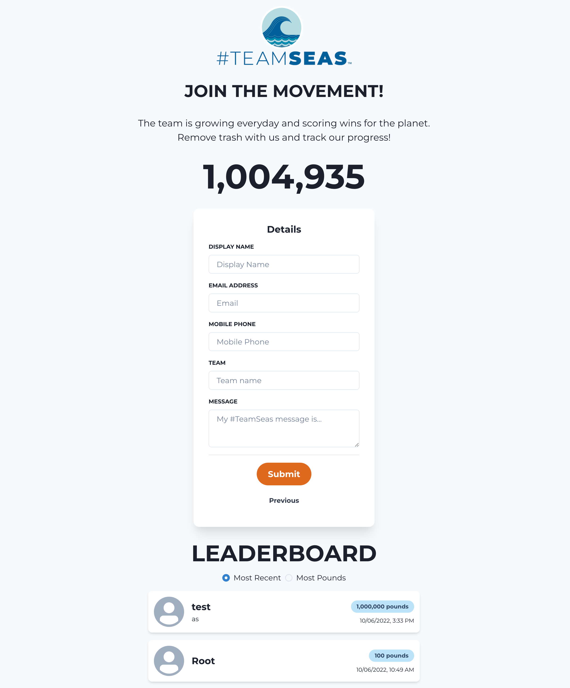

# Teamseas

Basic React project for donations and leaderboard.

## Home page

## Donation Form

## Stack

* [React 18.2.0](https://reactjs.org/)
* [@chakra-ui/react 2.3.5](https://chakra-ui.com/getting-started)
    * [Formik 2.2.9](https://formik.org/)

        Build forms in React, without the tears

                1. Getting values in and out of form state
                2. Validation and error messages
                3. Handling form submission
    * [Yup 0.32.11](https://formik.org/docs/guides/validation) - [Github](https://github.com/jquense/yup)
        
        Schema-based form-level validation for Formik
* [Urql 3.0.3](https://formidable.com/open-source/urql/)
    
    A highly customizable and versatile GraphQL client for React
* [Graphql-ws 5.11.2](https://github.com/enisdenjo/graphql-ws)
    
    GraphQL over WebSocket Protocol compliant server and client.
    
    Subscriptions are usually implemented with WebSockets, where the server holds a steady connection to the client.

This project was bootstrapped with
[Create React App](https://github.com/facebook/create-react-app).

## Available Scripts

In the project directory, you can run:

### `npm start`

Runs the app in the development mode.  Open
[http://localhost:3000](http://localhost:3000) to view it in the browser.

The page will reload if you make edits.  You will also see any lint errors
in the console.

### `npm test`

Launches the test runner in the interactive watch mode.  See the section
about
[running tests](https://facebook.github.io/create-react-app/docs/running-tests)
for more information.

### `npm run build`

Builds the app for production to the `build` folder.  It correctly bundles
React in production mode and optimizes the build for the best performance.

The build is minified and the filenames include the hashes.  Your app is
ready to be deployed!

See the section about
[deployment](https://facebook.github.io/create-react-app/docs/deployment) for
more information.

### `npm run eject`

**Note: this is a one-way operation. Once you `eject`, you can’t go back!**

If you aren’t satisfied with the build tool and configuration choices, you can
`eject` at any time. This command will remove the single build dependency from
your project.

Instead, it will copy all the configuration files and the transitive
dependencies (webpack, Babel, ESLint, etc) right into your project so you have
full control over them. All of the commands except `eject` will still work, but
they will point to the copied scripts so you can tweak them. At this point
you’re on your own.

You don’t have to ever use `eject`. The curated feature set is suitable for
small and middle deployments, and you shouldn’t feel obligated to use this
feature. However we understand that this tool wouldn’t be useful if you couldn’t
customize it when you are ready for it.

## Learn More

You can learn more in the
[Create React App documentation](https://facebook.github.io/create-react-app/docs/getting-started).

To learn React, check out the [React documentation](https://reactjs.org/).
